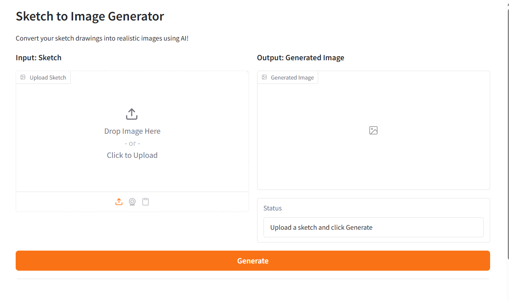
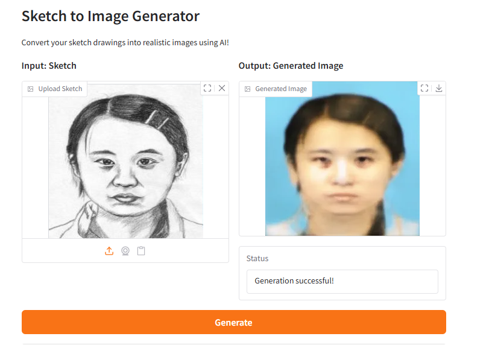

# Sketch to Image Frontend Demo - Gradio

**Một ứng dụng web đơn giản để demo model Sketch-to-Image Pix2Pix.**





## Yêu cầu

- Python 3.8+
- PyTorch (GPU optional nhưng nên có)

##  Cách chạy

### Option 1: Chạy script 
```bash
chmod +x run_app.sh
./run_app.sh
```

### Option 2: Chạy thủ công
```bash
# Cài đặt dependencies
pip install -r requirements_app.txt

# Chạy app
python app.py
```

App sẽ mở tại **http://127.0.0.1:7860** 
hoặc public link sẽ xuất hiện ( nếu chạy trên Colab)

## Cách sử dụng

1. **Upload sketch** - Chọn ảnh sketch (đen trắng)
2. **Bấm "Generate"** - Chạy model inference
3. **Xem kết quả** - Ảnh sinh ra hiển thị ngay

## Cấu hình

### Đường dẫn checkpoint model
Có thể download checkpoint pretrained sẵn tại:
[checkpoint_model_link][link]

[link]: https://drive.google.com/file/d/1026Ia99SDo-hOSjWvLms9eAG0nAyGKdX/view?usp=sharing

Mặc định app tìm model tại:
- `results/checkpoints/best_model.pkl` 
- `checkpoints/best_model.pkl`


##  Troubleshooting

### Lỗi "Model not loaded"
- Kiểm tra đường dẫn checkpoint có đúng không
- Kiểm tra file `best_model.pkl` có tồn tại không

### GPU memory lỗi
- Kiểm tra GPU có đủ memory không (thường cần ~2GB)
- Nếu không, chạy trên CPU (chậm hơn)

### App chạy chậm
- Nếu không có GPU, sẽ chậm hơn 5-10 lần
- Có thể giảm input size xuống 128x128

##  Tips

- Sử dụng sketch **đen trắng** cho kết quả tốt nhất
- Ảnh sẽ được tự động resize về 256x256
- Inference lần đầu sẽ mất thời gian (model loading)
- Lần thứ 2+ nhanh hơn vì model đã load

